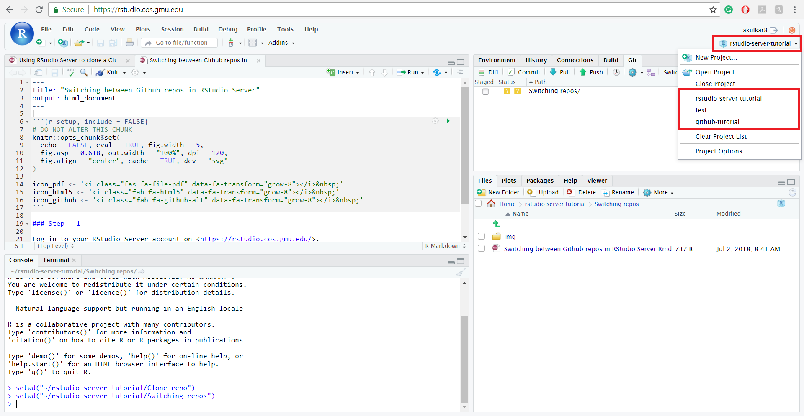

```{r setup, include=FALSE}
knitr::opts_chunk$set(echo = TRUE)
```

## R Markdown

This is an R Markdown document. Markdown is a simple formatting syntax for authoring HTML, PDF, and MS Word documents. For more details on using R Markdown see <http://rmarkdown.rstudio.com>.

When you click the **Knit** button a document will be generated that includes both content as well as the output of any embedded R code chunks within the document. You can embed an R code chunk like this:

```{r cars}
summary(cars)
```

## Including Plots

You can also embed plots, for example:

```{r pressure, echo=FALSE}
plot(pressure)
```

Note that the `echo = FALSE` parameter was added to the code chunk to prevent printing of the R code that generated the plot.

*What happens when you surround text with one-star pairs?* It makes the text italic.

**What happens when you surround text with two-star pairs?** It makes the text bold.

***What happens when you surround text with three-star pairs?*** It makes the text bold and Italic

1.  Start typing this list. Note there are two spaces between the period 
    and the word "Start".
2.  Type the second line of the list
1.  What happens if I type step 3 as another step 1? The knitting corrects the innumeration and instead of 1. it knits 3.

*   What does this star at the beginning do? The star creates a bullet point
*   Visually, it's similar to the numbered list.

1.  What happens if we nest a list? It creates a nest within a nest.
    1.  Type four spaces, then type the number
    2.  Did this do what you expected? YES, except I would prefer it to be letters i stead of number. Something like: 
1. First Sentence
    a. First nisted sentence.
    b. Second nisted sentence.
    
2.  What if we contine the numbers this way?
    *   What happens if we indent using stars? it creates bullets with empty small circle.
    *   Let's add another one for good measure.
        *   Can we get another level of nesting? Yes, this is awesome.
        
[What does this do?](https://google.com) It puts a link within a sentence.
        
